# AI-Powered Multi-Modal Content Generation System 🐉

<div align="center">

[](https://opensource.org/licenses/MIT)
[](https://www.python.org/downloads/)
[](https://github.com/langchain-ai/langgraph)
</div>

---

## 📖 Introduction

A complete full-stack SaaS application that transforms AI-powered deep search into a beautiful web platform where users can generate professional documents, reports, and presentations via an intuitive UI.

The system employs a multi-agent collaborative architecture, orchestrating agent workflows via LangGraph to achieve end-to-end automation from requirement analysis, information retrieval, content generation, to format export.

### ✨ Key Features

#### 🎯 User Features
- **Smart Document Generation**: AI-powered reports, analyses, research papers, and presentations
- **Multiple Document Types**: General reports, in-depth analysis, research papers, daily briefs, HTML presentations, and fiction
- **Real-Time Progress**: WebSocket-powered live updates during document generation
- **Beautiful UI**: Modern, responsive React interface with Tailwind CSS
- **Project Management**: Create, track, and organize all your document projects
- **Advanced Analytics**: Comprehensive usage statistics and insights
- **Subscription Tiers**: Free, Pro, and Enterprise plans with different limits

#### 🔧 Technical Features
- **RESTful API**: FastAPI backend with automatic OpenAPI documentation
- **Authentication**: JWT-based secure authentication system
- **Real-Time Updates**: WebSocket connections for live progress tracking
- **Async Processing**: Background task queue for document generation
- **Database**: SQLite (dev) / PostgreSQL (production) with SQLAlchemy ORM
- **Caching**: Redis for task queuing and caching
- **Multi-Agent Collaboration**: Agent orchestration based on LangGraph with task decomposition and parallel execution
- **Document-Aware Input**: Ingest `.txt`, `.pdf`, `.docx` as structured context for any workflow
- **Intelligent Search**: Automated web search, content extraction, and knowledge integration
- **Professional Export**: Supports Markdown, HTML, PDF, DOCX, PPTX formats
- **Monitoring**: Integrated LangFuse tracing for LLM operations
- **Docker Support**: Complete containerization with docker-compose
- **Production Ready**: HTTPS, health checks, logging, error handling

---

## 📸 Screenshots

### Create New Project - Project Details

*Create a new project with detailed configuration options, including project title, description, image generation toggle, and research query input.*

### Create New Project - Document Type Selection

*Select document type (General Report, Analysis, Research, Daily Brief, or Presentation) and output format (HTML or Markdown) for your AI-generated content.*

---

## 🚀 Quick Start

### Prerequisites
- Python 3.10+
- Node.js 18+ (for local frontend development)
- Docker & Docker Compose (recommended)
- OpenAI API key (or alternative LLM provider)
- Bing Search API key (optional)

### Option 1: Docker (Recommended)

```bash
# 1. Clone and navigate
git clone 
cd  # or your project directory name

# 2. Configure environment
cp .env.example .env
nano .env  # Add your API keys

# 3. Start all services
make docker-up

# Or manually:
docker-compose up -d

# 4. Access the application
# Frontend: http://localhost:3000
# Backend:  http://localhost:8000
# API Docs: http://localhost:8000/api/docs
```

### Option 2: Local Development

**Backend:**
```bash
# Install dependencies
pip install -r requirements.txt
pip install -r backend/requirements.txt

# Start Redis
docker run -d -p 6379:6379 redis:7-alpine

# Start backend
cd backend
python -m uvicorn main:app --reload --host 0.0.0.0 --port 8000
```

**Frontend:**
```bash
# Install dependencies
cd frontend
npm install

# Start dev server
npm run dev
```

### Option 3: Command Line Interface

For CLI-only usage without the web interface:

```bash
# 1. Install dependencies
pip install -r requirements.txt

# 2. Configure environment
cp .env.example .env
# Add your API keys to .env

# 3. Run commands
python cli.py report "Your research topic"
python cli.py fiction "Your story idea"
python cli.py ppt "Your presentation topic"
```

---

## 🏗️ Architecture

### System Architecture

```
┌─────────────────────────────────────────────────────────┐
│                     Frontend (React)                     │
│  - Dashboard  - Projects  - Analytics  - Settings       │
│  - WebSocket Client  - Real-time Updates                  │
└────────────────┬────────────────────────────────────────┘
                 │ HTTP/WebSocket
┌────────────────▼────────────────────────────────────────┐
│                  Backend API (FastAPI)                   │
│  - Authentication  - Projects API  - Documents API       │
│  - WebSocket Manager  - Background Tasks                │
└───┬──────────────┬──────────────┬──────────────┬────────┘
    │              │              │              │
    ▼              ▼              ▼              ▼
┌────────┐    ┌─────────┐   ┌──────────┐   ┌─────────────┐
│Database│    │  Redis  │   │  Storage │   │   Engine    │
│        │    │  Cache  │   │  System  │   │  Deep Search │
│SQLite/ │    │  Queue  │   │  Files   │   │  Generator   │
│Postgres│    │         │   │          │   │              │
└────────┘    └─────────┘   └──────────┘   └─────────────┘
```

### Multi-Agent Workflow

The core engine uses LangGraph-based state machine workflow with conditional routing based on document type:

```mermaid
graph TD
    A[👤 User Input] --> B[🎯 Output Type Detector]
    B -->|Report/PPT| C[📋 Task Decomposer]
    B -->|Fiction| F1[📚 Fiction Elements Designer]
    
    C --> D[🌐 Deep Searcher]
    F1 --> C
    
    D -->|Report/PPT| E[🔍 Search Analyzer]
    D -->|Fiction| F2[📖 Fiction Outline Generator]
    
    E -->|Report| G[📦 Content Synthesizer]
    E -->|PPT| H[📊 PPT Generator]
    
    G --> I[✨ Report Generator]
    F2 --> J[✍️ Fiction Writer]
    
    I --> K[📤 Export Output]
    H --> K
    J --> K

    style A fill:#e3f2fd,stroke:#1976d2
    style B fill:#f3e5f5,stroke:#7b1fa2
    style C fill:#f3e5f5,stroke:#7b1fa2
    style D fill:#fff3e0,stroke:#f57c00
    style E fill:#fff3e0,stroke:#f57c00
    style G fill:#e8f5e9,stroke:#388e3c
    style I fill:#e8f5e9,stroke:#388e3c
    style H fill:#e8f5e9,stroke:#388e3c
    style F1 fill:#fce4ec,stroke:#c2185b
    style F2 fill:#fce4ec,stroke:#c2185b
    style J fill:#fce4ec,stroke:#c2185b
    style K fill:#fce4ec,stroke:#c2185b
```



### Content Generation Workflow

```mermaid
sequenceDiagram
    autonumber
    participant User as 👤 User
    participant Web as 🌐 Web App
    participant API as 🔌 Backend API
    participant BackgroundTask as ⚙️ Background Task
    participant Agent as 🤖 DeepSearch Agent
    participant Coordinator as 🧠 LangGraph Coordinator
    participant Storage as 💾 Storage
    participant WebSocket as 📡 WebSocket Manager

    User->>Web: Create project
    Web->>API: POST /api/projects
    API->>API: Create project in DB
    API->>BackgroundTask: Add background task
    API-->>Web: Return project ID
    Web->>User: Show progress (0%)

    BackgroundTask->>API: Update status (PROCESSING, 0%)
    API->>WebSocket: Send progress update
    WebSocket->>Web: WebSocket message (0%)
    Web->>User: Show progress (0%)

    BackgroundTask->>Agent: Initialize DeepSearchAgent
    Agent->>Coordinator: Process query with LangGraph
    Coordinator->>Coordinator: Execute workflow nodes
    
    Note over Coordinator: Output Type Detection<br/>Task Decomposition<br/>Deep Search<br/>Content Synthesis<br/>Report Generation
    
    Coordinator->>Storage: Save document
    Coordinator-->>Agent: Return result
    Agent-->>BackgroundTask: Generation complete
    
    BackgroundTask->>API: Update status (COMPLETED, 100%)
    API->>WebSocket: Send completion notification
    WebSocket->>Web: WebSocket message (100%)
    Web->>User: Show completion
```



---

## 💡 CLI Usage Guide

> **💡 Using the Web Application?** See [SaaS User Guide](./docs/SAAS_USER_GUIDE.md) and [Deployment Guide](./docs/SAAS_DEPLOYMENT_GUIDE.md)
>
> The following section covers command-line interface usage. For web application usage, refer to the documentation above.

### Use Existing Documents as Context

All generation commands accept `--input-file` to preload `.txt`, `.pdf`, or `.docx` files. The document is parsed, summarised, and injected as high-priority context (images are not supported yet).

```bash
# Generate a report from an existing brief
python cli.py report "AI Startup Business Plan" --input-file ./docs/company_overview.pdf

# Novel creation seeded with world-building notes
python cli.py fiction "Interstellar odyssey" --genre scifi --input-file ./docs/worldbuilding.txt

# Build a deck from meeting notes
python cli.py ppt "Board strategy update" --style business --input-file ./docs/board_meeting.docx
```

### Basic Commands

The system provides a clean command-line interface:

```bash
python cli.py [command] [arguments] [options]
```

### 1. Generate Research Report

```bash
# Basic usage
python cli.py report "2025 AI Industry Trends Analysis"

# With style and depth options
python cli.py report "Blockchain Technology Research" \
  --style academic \
  --depth comprehensive \
  --verbose
```

**Style Options**:
- `business`: Business report (default)
- `academic`: Academic paper
- `technical`: Technical documentation
- `consulting`: Consulting report

**Depth Options**:
- `overview`: Overview (fast)
- `standard`: Standard (default)
- `comprehensive`: In-depth

### 2. Generate Novel

```bash
# Basic usage
python cli.py fiction "A sci-fi story about time travel"

# With style and chapter options
python cli.py fiction "Urban mystery thriller" \
  --style mystery \
  --chapters 10 \
  --verbose
```

**Style Options**:
- `romance`: Romance
- `scifi`: Science Fiction
- `fantasy`: Fantasy
- `mystery`: Mystery
- `urban`: Urban Fiction

### 3. Generate Presentation

```bash
# Basic usage
python cli.py ppt "2025 AI Product Launch" --slides 15

# Full example with options
python cli.py ppt "Annual Company Review" \
  --style business \
  --slides 20 \
  --speech-notes "Presentation for all employees" \
  --verbose
```

**Style Options**:
- `business`: Business style (default)
- `creative`: Creative style
- `minimal`: Minimalist style
- `academic`: Academic style

**Speaker Notes**: Use `--speech-notes` to generate speaker notes for each slide

### 4. Iterate and Refine Content

Modify previously generated content:

```bash
# Modify report
python cli.py iterate <project_id> "Add more case studies in Chapter 2"

# Modify PPT
python cli.py iterate <project_id> "Change chart on slide 5 to pie chart"

# Modify novel
python cli.py iterate <project_id> "Rewrite Chapter 3 with more suspense"
```

**Project ID**: The folder name in `storage/` directory, e.g., `20251004_220823`

### 5. Export Functions

```bash
# Export to PDF
python cli.py export <project_id> pdf

# Export to DOCX
python cli.py export <project_id> docx

# Export to PPTX (PPT projects)
python cli.py export <project_id> pptx

# Custom output path
python cli.py export <project_id> pdf --output /path/to/output.pdf
```

---

## 📂 Project Structure

```
project/
├── backend/                    # FastAPI Backend
│   ├── main.py                # Main FastAPI application
│   ├── config.py              # Configuration management
│   ├── database.py            # Database models and setup
│   ├── tasks.py               # Background task processing
│   ├── websocket_manager.py  # WebSocket connection handler
│   ├── api/                   # API endpoints
│   │   ├── auth.py           # Authentication
│   │   ├── projects.py       # Project management
│   │   ├── documents.py      # Document operations
│   │   └── analytics.py      # Usage analytics
│   └── Dockerfile            # Backend container
│
├── frontend/                  # React Frontend
│   ├── src/
│   │   ├── App.jsx           # Main app component
│   │   ├── pages/            # Page components
│   │   │   ├── LandingPage.jsx
│   │   │   ├── DashboardPage.jsx
│   │   │   ├── ProjectsPage.jsx
│   │   │   ├── CreateProjectPage.jsx
│   │   │   ├── ProjectDetailPage.jsx
│   │   │   ├── AnalyticsPage.jsx
│   │   │   └── SettingsPage.jsx
│   │   ├── components/       # Reusable components
│   │   ├── lib/              # Utilities
│   │   │   ├── api.js        # API client
│   │   │   └── websocket.js  # WebSocket hook
│   │   └── stores/           # State management
│   ├── Dockerfile            # Frontend container
│   ├── nginx.conf            # Nginx configuration
│   └── package.json
│
├── src/                       # Core AI Engine
│   ├── deep_search_agent.py
│   ├── agents/                # Agent modules
│   │   ├── coordinator.py    # Main coordinator
│   │   ├── iteration_agent.py
│   │   ├── report/           # Report generation
│   │   ├── fiction/          # Fiction generation
│   │   ├── ppt/              # PPT generation
│   │   └── html/            # HTML conversion
│   ├── llm/                  # LLM management
│   ├── searcher/             # Search module
│   ├── export/               # Export module
│   └── storage/              # Storage management
│
├── docs/                      # Documentation
│   ├── SAAS_README.md
│   ├── SAAS_DEPLOYMENT_GUIDE.md
│   └── SAAS_USER_GUIDE.md
│
├── docker-compose.yml         # Container orchestration
├── Makefile                   # Convenient commands
├── cli.py                    # CLI entry point
└── requirements.txt          # Dependencies
```

---

## 📊 Subscription Plans

### Free Tier
- **5 documents/month**
- Basic templates
- Community support
- HTML & Markdown export
- **Perfect for**: Trying out the platform

### Pro Tier - $29/month
- **50 documents/month**
- Advanced templates
- Priority support
- All export formats
- API access
- Custom branding
- **Perfect for**: Regular users, small businesses

### Enterprise - Custom Pricing
- **Unlimited documents**
- Custom integrations
- Dedicated support
- SLA guarantee
- Advanced analytics
- Team collaboration
- **Perfect for**: Large organizations, agencies

## 📡 API Endpoints

### Authentication
- `POST /api/auth/register` - Register new user
- `POST /api/auth/login` - Login and get token
- `GET /api/auth/me` - Get current user
- `POST /api/auth/logout` - Logout

### Projects
- `GET /api/projects` - List projects
- `POST /api/projects` - Create project
- `GET /api/projects/{id}` - Get project details
- `PATCH /api/projects/{id}` - Update project
- `DELETE /api/projects/{id}` - Delete project
- `POST /api/projects/{id}/cancel` - Cancel project

### Documents
- `GET /api/documents/{id}/download` - Download document
- `GET /api/documents/{id}/preview` - Preview document
- `GET /api/documents/{id}/metadata` - Get metadata

### Analytics
- `GET /api/analytics/dashboard` - Dashboard statistics
- `GET /api/analytics/usage` - Detailed usage stats

### WebSocket
- `WS /ws/{client_id}` - Real-time updates

See [API Documentation](http://localhost:8000/api/docs) for interactive API docs when running.

---

## 🔧 Configuration

### Environment Variables

Create a `.env` file with the following:

```bash
# LLM Configuration
DEFAULT_LLM_PROVIDER=openai
DEFAULT_LLM_MODEL=gpt-4o-mini
OPENAI_API_KEY=sk-...

# Or use Anthropic
ANTHROPIC_API_KEY=your_anthropic_api_key
ANTHROPIC_MODEL=claude-3-5-sonnet-20251022

# Or use DeepSeek
DEEPSEEK_API_KEY=your_deepseek_api_key
DEEPSEEK_BASE_URL=https://api.deepseek.com/v1
DEEPSEEK_MODEL=deepseek-chat

# Search (Optional)
PERPLEXITY_API_KEY=your_perplexity_api_key
BING_API_KEY=...

# Monitoring (Optional)
LANGFUSE_PUBLIC_KEY=pk-...
LANGFUSE_SECRET_KEY=sk-...
LANGFUSE_HOST=https://cloud.langfuse.com

# Backend
SECRET_KEY=your-super-secret-key-min-32-chars
DATABASE_URL=sqlite:///./docugen_saas.db
REDIS_URL=redis://localhost:6379/0

# Optional: Email & Stripe
SMTP_HOST=smtp.gmail.com
SMTP_USER=your-email@gmail.com
STRIPE_API_KEY=sk_test_...
```

See `.env.example` for complete configuration options.

### Generating Secret Key

```bash
python -c "import secrets; print(secrets.token_urlsafe(32))"
```

---

## 🛠️ Available Commands

```bash
# Development
make install              # Install all dependencies
make dev-backend          # Start backend server
make dev-frontend         # Start frontend server
make dev-redis            # Start Redis

# Docker
make docker-up            # Start containers
make docker-down          # Stop containers
make docker-logs          # View logs
make docker-restart       # Restart containers

# Database
make db-reset             # Reset database
make backup-db            # Backup database

# Deployment
make deploy-build         # Build for production
make deploy-up            # Deploy to production

# Maintenance
make clean                # Clean build artifacts
make health-check         # Check service health
make logs-backend         # View backend logs
```

## 📊 Roadmap

### Current Features (v1.0)
- ✅ User authentication and authorization
- ✅ Project creation and management
- ✅ Real-time progress tracking
- ✅ Multiple document types (Report, Analysis, Research, Daily Brief, PPT, Fiction)
- ✅ Analytics dashboard
- ✅ Subscription tiers (UI)
- ✅ Docker deployment
- ✅ CLI interface
- ✅ Multi-format export (HTML, Markdown, PDF, DOCX, PPTX)

### Planned Features (v1.1+)
- [ ] Stripe payment integration
- [ ] API key generation for Pro/Enterprise
- [ ] Team collaboration features
- [ ] Custom templates
- [ ] Document sharing and public links
- [ ] Webhook notifications
- [ ] Multi-language support
- [ ] Advanced search filters
- [ ] Batch document generation
- [ ] Custom branding options
- [ ] Image insertion in documents
- [ ] Excel data analysis
- [ ] Database query and analysis

---

## 🔒 Security

- HTTPS/SSL encryption
- JWT token authentication
- Password hashing with bcrypt
- SQL injection protection (SQLAlchemy ORM)
- CORS configuration
- Rate limiting (recommended for production)
- Environment variable secrets
- Input validation

## 🐛 Known Issues

1. **PDF export on macOS requires system libraries**: Need to install `pango` and other libraries via Homebrew
2. **First-time Playwright use requires browser download**: Run `playwright install chromium`
3. **Large PPT export may be slow**: Complex layouts and charts take time to generate
4. **Limited iteration support for PPT projects**: PPT iteration currently regenerates the entire presentation

---

## 🤝 Contributing

We welcome all forms of contributions!

### How to Contribute

1. Fork the repository
2. Create a feature branch (`git checkout -b feature/AmazingFeature`)
3. Commit your changes (`git commit -m 'Add some AmazingFeature'`)
4. Push to the branch (`git push origin feature/AmazingFeature`)
5. Open a Pull Request

### Report Bugs

Please report issues via [GitHub Issues](https://github.com/jaguarliuu/xunlong/issues) with:

- Detailed problem description
- Steps to reproduce
- System environment information
- Relevant log output

---

## 📝 FAQ

### Q: Which LLM models are supported?
A: Currently supports OpenAI (GPT-4/GPT-3.5), Anthropic (Claude series), DeepSeek, etc. Through LangChain integration, theoretically supports all OpenAI API-compatible models.

### Q: How long does it take to generate a document?
A: Typically 30-120 seconds, depending on query complexity, document type, and current server load.

### Q: Can it be used offline?
A: No. The system requires LLM API calls and web searches, so internet connection is necessary.

### Q: Can generated content be used commercially?
A: Generated content follows MIT license, but note: 1) Comply with LLM provider's terms of service 2) Take responsibility for content accuracy and legality.

### Q: How to improve generation quality?
A: Suggestions: 1) Use more powerful models (e.g., GPT-4) 2) Provide more detailed requirements 3) Use iteration feature for refinement 4) Configure Perplexity API for better search results.

### Q: Is there an API?
A: Yes! Pro and Enterprise tiers include API access. See API documentation for details.

### Q: How do I get support?
A: Free tier: Community forum. Pro tier: Email support (24-48h response). Enterprise: Dedicated support manager.

---

## 📚 Documentation

- **[SaaS Deployment Guide](./docs/SAAS_DEPLOYMENT_GUIDE.md)**: Complete deployment instructions
- **[SaaS User Guide](./docs/SAAS_USER_GUIDE.md)**: End-user documentation
- **[SaaS README](./docs/SAAS_README.md)**: Detailed SaaS platform documentation
- **[API Documentation](http://localhost:8000/api/docs)**: Interactive API docs (when running)

---

## 📄 License

This project is licensed under the [MIT License](LICENSE).

---

## 🙏 Acknowledgments

Built on top of powerful open-source technologies:

- [FastAPI](https://fastapi.tiangolo.com/) - High-performance API framework
- [React](https://react.dev/) + [Vite](https://vitejs.dev/) - Modern frontend
- [LangChain](https://github.com/langchain-ai/langchain) - LLM application framework
- [LangGraph](https://github.com/langchain-ai/langgraph) - Graph-based state machine workflow
- [LangFuse](https://langfuse.com/) - LLM observability platform
- [Playwright](https://playwright.dev/) - Browser automation
- [WeasyPrint](https://weasyprint.org/) - HTML to PDF conversion
- [python-pptx](https://python-pptx.readthedocs.io/) - PowerPoint generation
